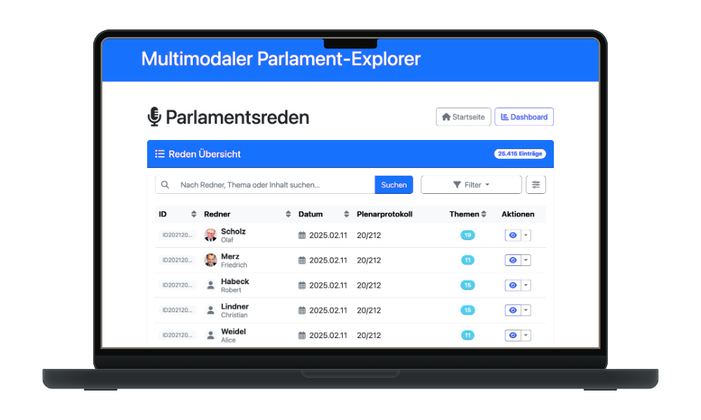
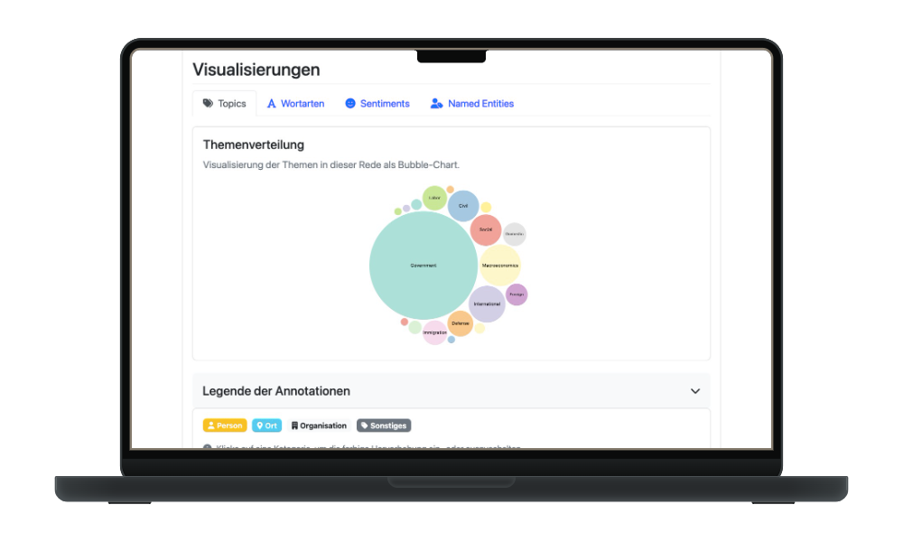

  
  
  
  
  
  
  

 

  

<h3 align="center">Multimodal Parliament Explorer</h3>

Final project of the programming lab — visualizing and analyzing German Bundestag plenary protocols.

  
  &nbsp;
  

---

> [!NOTE]
> **Group project.** This is the repository of our group project, which all four team members contributed to. It was first hosted at `github.com/Kuuhhl/multimodal_parliament_explorer`.

## About the project

The **Multimodal Parliament Explorer** makes speeches from the German Bundestag searchable and analyzable. Plenary protocols are imported, enriched with NLP techniques, and presented together with the corresponding video. Results can be visualized interactively and exported as XML or PDF.

## Features

* View parliamentary speeches alongside their video
* Information about speakers and protocols
* Visualization of NLP analyses through interactive charts (D3)
* Full-text and advanced search
* Export as XML / PDF (via LaTeX)

## Tech stack

Java 17 · Javalin · Apache FreeMarker · MongoDB · D3.js · LaTeX · Docker

## Requirements

* Git
* Docker

## Usage (with Docker)

1. Clone the repository: `git clone https://github.com/autokaiai/multimodal_parliament_explorer`
2. Enter the directory: `cd multimodal_parliament_explorer`
3. Build the Docker image: `docker build -t multimodal_parliament_explorer .`
4. Start the container: `docker run --rm -d -p 7001:7001 multimodal_parliament_explorer`
5. Open in your browser: [http://localhost:7001](http://localhost:7001)

> [!TIP]
> For more detailed instructions, see the [user manual](benutzerhandbuch.md).

## Screenshots

  
  

## Team

This project was developed collaboratively by the following four people:

* Philipp Hein
* Philipp Landmann
* Philip Schneider
* Kai Alois Wöllstein

## License & citation

Released under the [MIT License](LICENSE).

Any use, reuse, or distribution must credit **all four team members** (Philipp Hein, Philipp Landmann, Philip Schneider, and Kai Alois Wöllstein). The full license and copyright notice from the [`LICENSE`](LICENSE) file must be retained.
